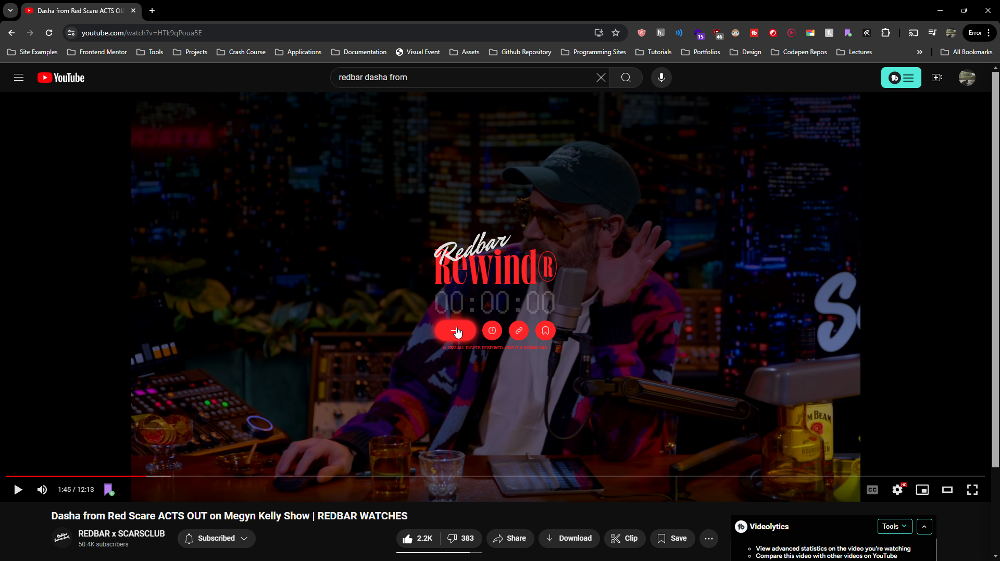
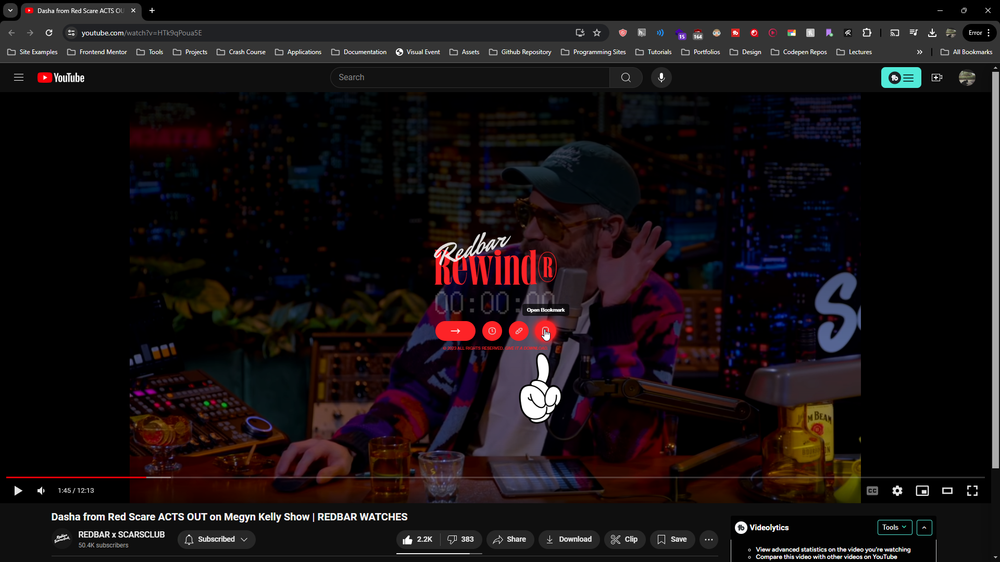
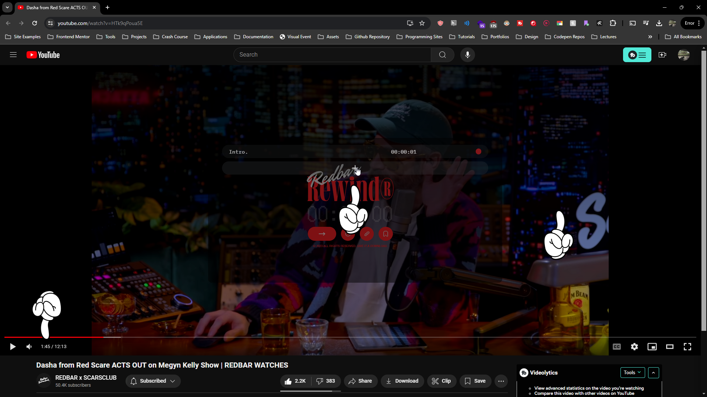
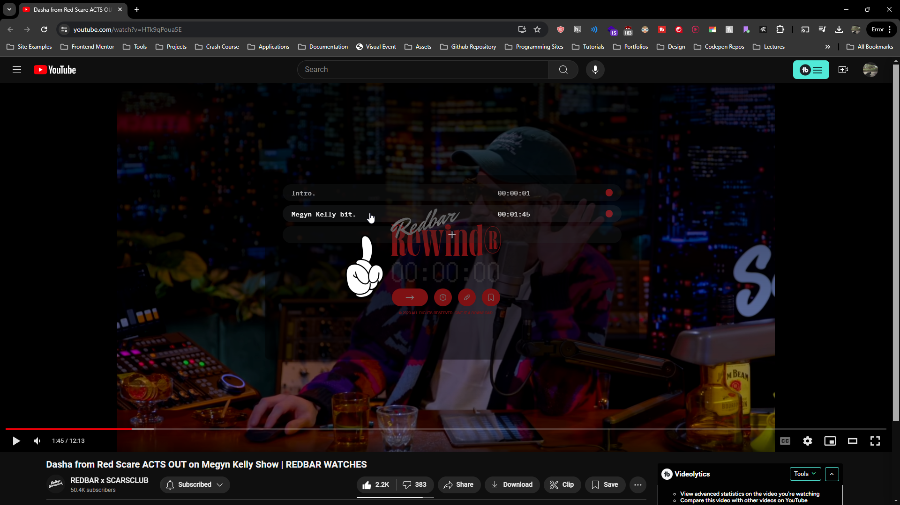
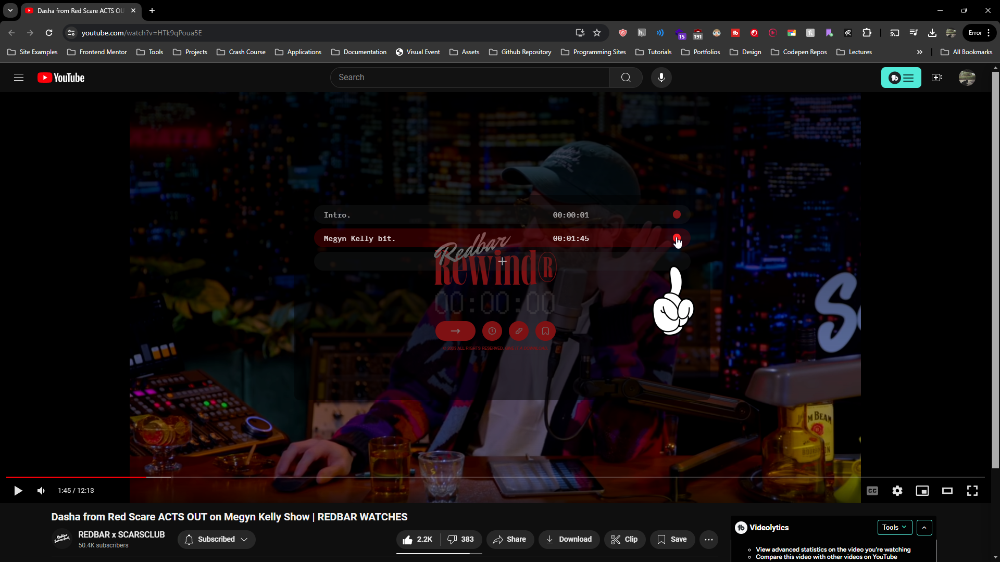
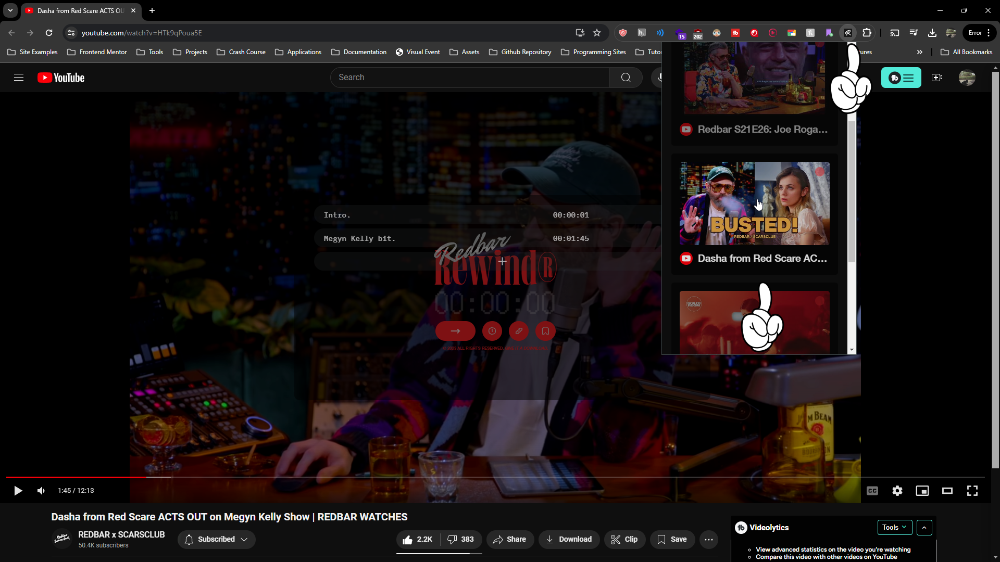
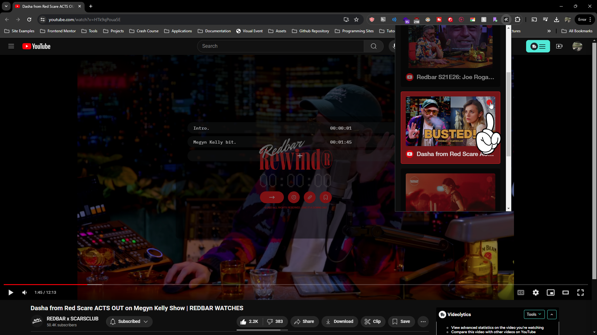

# RedbarRewind

A video overlay for Youtube + Spotify that allows for specific timestamp playback.

Give it a year.™

# Guide

Open the overlay with ***CTRL + ALT*** on Windows machines and ***CMD + ALT*** on Apple machines. Linux is also supported.

### UI

The base overlay allows for 4 basic functions.

1. Enter a specific timestamp into the input and submit to jump to that timestamp.
2. Copy the video's current timestamp.
3. Copy the video link w/ specific timestamp. (Only supported on Youtube)
4. Open the bookmark overlay.

Available support for specific websites is made apparent with disabled buttons. 

### Bookmark Modal

Click on the Bookmark button to enable the Bookmark overlay.

### Adding Entries

Click on the + button to add your video's current timestamp to a locally saved repository. This timestamp will remain after you've refreshed the page.

*Note: You cannot add two entries at the same timestamp.*

To edit, hold click on the entry to enable the input again and enter your new label. To close the bookmark, click on the original RedbarRewind overlay.

Enter your label into the input that appears and press ENTER or click outside of the label to save.

The + button also allows users to enter their bookmark entries automatically via test file. Create a text file with the following ***example*** format:

<pre>https://www.youtube.com/watch?v=HRd5NIm67L8 
00:12:00 - He is eating.
00:15:00 - He is not eating.
https://www.youtube.com/watch?v=dHsCb-dDGnU
01:12:00 - Something is happening.
02:12:08 - Something else happens.</pre>

Then drag and drop the file onto the + button to enter multiple entries at once.

To delete the entries individually, head to the bookmark's address and open the bookmark overlay. Click on the red circle icon to delete the timestamp entry from local storage.

### Bookmark Timeline

To check which videos you've added bookmark entries for, click on the RedbarRewind extension icon. If you've populated your local storage with bookmarks, there will be a list of modals you can scroll through. 

Clicking on these modals will open a new tab with your stored link. To delete the entire link, along with all associated bookmarks, from your storage, click on the red circle icon to the top-right of the image.

If you encounter any issues with the extension, feel free to reach out. 

This application is in the public domain. Download, change, enhance, repurpose, and re-release it however you'd like. 
